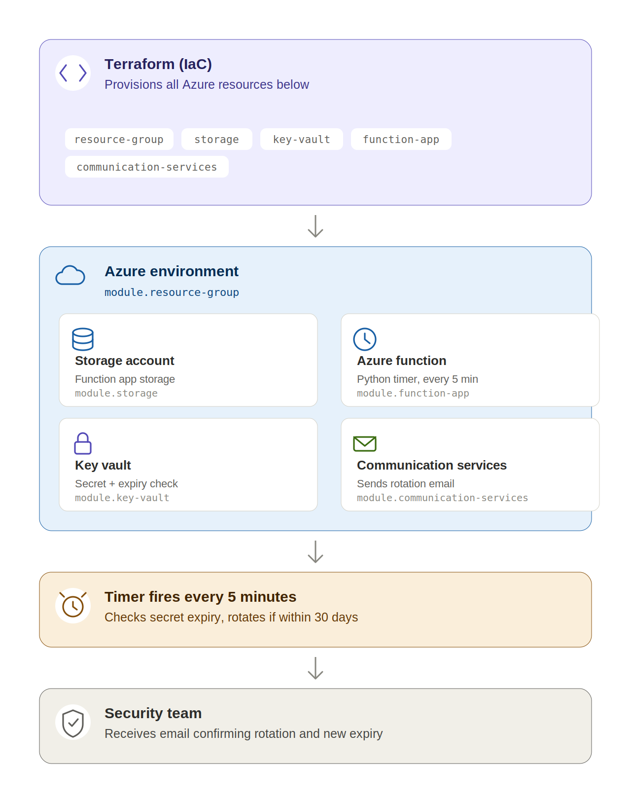

# Automated Azure Key Vault Secret Rotation Pipe
> A production-inspired cloud security automation project built with Azure, Terraform, Python and Azure Functions.

---

# Why I Built This Project
Secrets such as API keys, database passwords, certificates, and connection strings are fundamental to modern cloud applications. However, they are often created once and forgotten until they expire or become compromised.

In many organizations, secret rotation is still performed manually. This creates several operational and security challenges:

- Expired secrets can cause application outages.
- Long-lived credentials increase the risk of unauthorized access.
- Manual rotation is repetitive, error-prone, and difficult to audit.
- Security teams spend valuable time performing routine maintenance instead of focusing on higher-value work.

As an aspiring Cloud Security Engineer, I wanted to build a solution that demonstrates how cloud automation can reduce operational risk while improving security.

This project automatically monitors Azure Key Vault, detects secrets approaching expiration, rotates them, and immediately notifies the team using Azure Communication Services.

The objective was not simply to automate a task, but to build a solution that reflects real-world cloud engineering practices using Infrastructure as Code, serverless computing, secure identity, and automated notifications.

---

# Project Overview

This project provisions Azure infrastructure using Terraform and deploys a Python Azure Function that automatically:

- Monitors Azure Key Vault secrets
- Detects secrets nearing expiration
- Generates a new secure password
- Updates the secret in Azure Key Vault
- Extends the expiration date
- Sends an email notification to the operations team
- Logs the entire execution process

The function runs automatically on a scheduled timer without requiring manual intervention.

---

# Architecture
   


# Technologies Used

| Technology | Purpose |
|------------|----------|
| Microsoft Azure | Cloud Platform |
| Terraform | Infrastructure as Code |
| Azure Functions | Serverless Automation |
| Azure Key Vault | Secret Management |
| Azure Communication Services | Email Notifications |
| Azure Storage Account | Function Storage |
| Python | Automation Logic |
| Azure CLI | Authentication |
| GitHub | Source Control |

---
# Features

- Infrastructure deployed using Terraform
- Secure secret storage using Azure Key Vault
- Automatic secret expiration monitoring
- Secure password generation
- Automatic secret rotation
- Email notifications after successful rotation
- Environment variables used for sensitive configuration
- Modular Terraform structure
- Timer-triggered serverless execution

# Repository Structure

```
azure-secret-rotation-pipeline
│
├── environments
│   └── dev
│
├── modules
│   ├── communication
│   ├── function-app
│   ├── key-vault
│   └── storage
│
├── function
│   ├── function_app.py
│   ├── requirements.txt
│   ├── host.json
│   └── local.settings.json.example

```

---


# Project Workflow

1. Azure Function starts on a timer.
2. Authenticates using Azure CLI credentials.
3. Connects to Azure Key Vault.
4. Reads the target secret.
5. Calculates the remaining lifetime.
6. If the secret is nearing expiration:
   - Generates a new secure password.
   - Updates Azure Key Vault.
   - Extends the expiration date.
   - Sends an email notification.
7. Logs the execution.

---
## Getting Started

### Prerequisites

- An [Azure subscription](https://azure.microsoft.com/free/) (a student/free-tier subscription works)
- [Terraform](https://developer.hashicorp.com/terraform/downloads) >= 1.5
- [Azure CLI](https://learn.microsoft.com/cli/azure/install-azure-cli) installed and authenticated (`az login`)
- Python 3.9+ (for local testing of the Function code)

### 1. Clone the repository

```bash
git clone https://github.com/Kel202/azure-secret-rotation-pipeline.git
cd azure-secret-rotation-pipeline
```

### 2. Configure your environment

Copy the example variables file and fill in your own values (subscription ID, resource group name, notification email, etc.). This file is git-ignored so your values never get committed.

```bash
cd environments/dev
cp terraform.tfvars.example terraform.tfvars
```

Then edit `terraform.tfvars` with your own values.

### 3. Initialize and deploy

```bash
terraform init
terraform plan
terraform apply
```

Terraform will provision the resource group, Key Vault, Storage Account, Function App, and Communication Services resource, then deploy the Python rotation function.

### 4. Verify

- Check the Azure Function App in the Portal to confirm the timer trigger is running.
- Check Key Vault → Secrets to see the target secret and its expiry date.
- Trigger a manual run (or wait for the timer) and confirm the notification email arrives.

### 5. Tear down

```bash
terraform destroy
```

---

## Security Considerations


This project was built with cloud security best practices in mind, not just automation:

- **No hardcoded credentials.** Authentication to Azure Key Vault is handled via Azure CLI credentials locally and is designed to use a **Managed Identity** in production rather than storing a service principal secret in code or config.
- **Least-privilege access.** The Function's identity is scoped with Key Vault access policies / RBAC limited to only the permissions it needs (get, list, set secret) — not full Key Vault Administrator rights.
- **Secrets never leave Key Vault in plaintext.** New passwords are generated and written directly to Key Vault; they are not logged, emailed, or exposed in Function output.
- **Sensitive files excluded from version control.** `.tfstate`, `.tfvars`, and `local.settings.json` are all git-ignored, since they can contain subscription IDs, secrets, or connection strings.
- **Auditability.** Every rotation run is logged, so there's a traceable record of when a secret was rotated and by what process — supporting audit and compliance requirements.
- **Fail-safe notification.** If a secret is approaching expiry and rotation succeeds (or fails), the operations team is notified via Azure Communication Services rather than relying on someone remembering to check.

**Known limitations / next steps:**
- Local development currently uses Azure CLI auth rather than Managed Identity — migrating fully to Managed Identity is a planned improvement.
- No automated tests yet for the rotation logic (unit tests planned).
- Currently single-environment (`dev`); a `prod` environment folder would need separate state and access controls.
      
